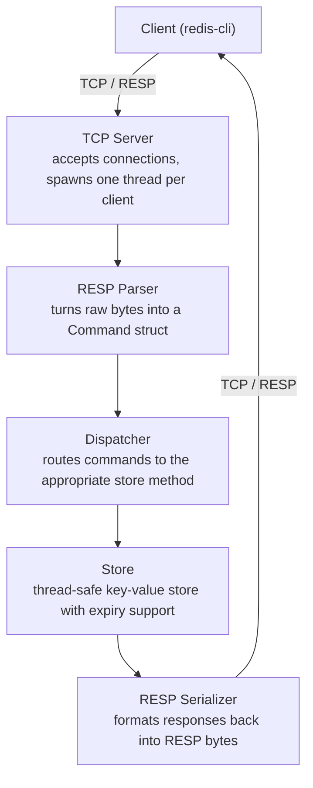

# redis-clone

A lightweight Redis-compatible server implemented in C++, built as a systems programming exercise. The server speaks the Redis Serialization Protocol (RESP), accepts concurrent client connections over TCP, and supports a growing subset of Redis commands including `GET`, `SET`, `DEL`, `EXPIRE`, and `TTL`.

The goal is not to replace Redis, but to understand it — by implementing the core pieces from scratch: a TCP server, a protocol parser, a thread-safe key-value store, and a command dispatcher. The project is built incrementally, with each commit leaving the server in a working state.


## Build
```bash
cmake -S . -B build
cmake --build build
./build/redis_clone
```

## Architecture

The server is built in four clean layers, each with a single responsibility:


Concurrency is handled with a thread-per-client model. The Store is protected by a `std::mutex` to prevent data races across threads. Key expiry uses a lazy strategy — expired keys are detected and removed on access rather than by a background scanner.


## Design Decisions

### Thread-per-client concurrency
Each client connection is handled by a dedicated `std::thread`. This is simpler to reason about than an event loop (`epoll`) and sufficient for a project of this scope. The tradeoff is that it does not scale well to thousands of simultaneous connections — a production system would use I/O multiplexing instead. This is a known limitation and a natural next step.

### Single mutex for the store
All store operations are protected by a single `std::mutex`. This is simple and correct, but means only one command can execute at a time across all threads. A more sophisticated approach would use reader-writer locks (`std::shared_mutex`) — multiple readers could proceed in parallel, with writers taking exclusive access. This optimization is left as a future improvement.

### Lazy expiry
Expired keys are not actively scanned — they are detected and removed only when accessed. This keeps the implementation simple and avoids the complexity of a background thread. The tradeoff is that expired keys sit in memory until something touches them. Real Redis combines lazy expiry with a periodic background scan that samples a subset of keys with TTLs — worth adding as a future improvement.

### RESP protocol fidelity
The server implements the RESP2 protocol as defined in the Redis documentation. All responses use proper RESP types — bulk strings for values, integers for counts, null bulk strings for missing keys, and error types for failures. This means any standard Redis client, not just `redis-cli`, can connect to this server.

### Value storage as strings
All values are stored internally as `std::string`, matching Redis's "everything is a string" philosophy for the string data type. Commands like `INCR` interpret the string as an integer at runtime and return an error if the conversion fails — the store itself remains type-agnostic.


## Supported Commands

| Command | Syntax | Description |
|---------|--------|-------------|
| PING | `PING [message]` | Returns PONG or echoes message |
| SET | `SET key value` | Store a key-value pair |
| GET | `GET key` | Retrieve value by key, nil if missing |
| DEL | `DEL key` | Delete a key, returns 1 if it existed |
| EXISTS | `EXISTS key` | Returns 1 if key exists, 0 otherwise |
| EXPIRE | `EXPIRE key seconds` | Set a TTL on a key |
| TTL | `TTL key` | Get remaining TTL, -1 if no expiry, -2 if missing |
| KEYS | `KEYS pattern` | List keys matching pattern, supports * and ? wildcards |
| INCR | `INCR key` | Increment integer value by 1, starts from 0 if missing |
| DECR | `DECR key` | Decrement integer value by 1, starts from 0 if missing |
| APPEND | `APPEND key value` | Append to a string value, returns new length |
| RENAME | `RENAME key newkey` | Rename a key, carries TTL over to new name |


